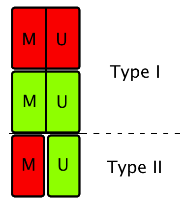
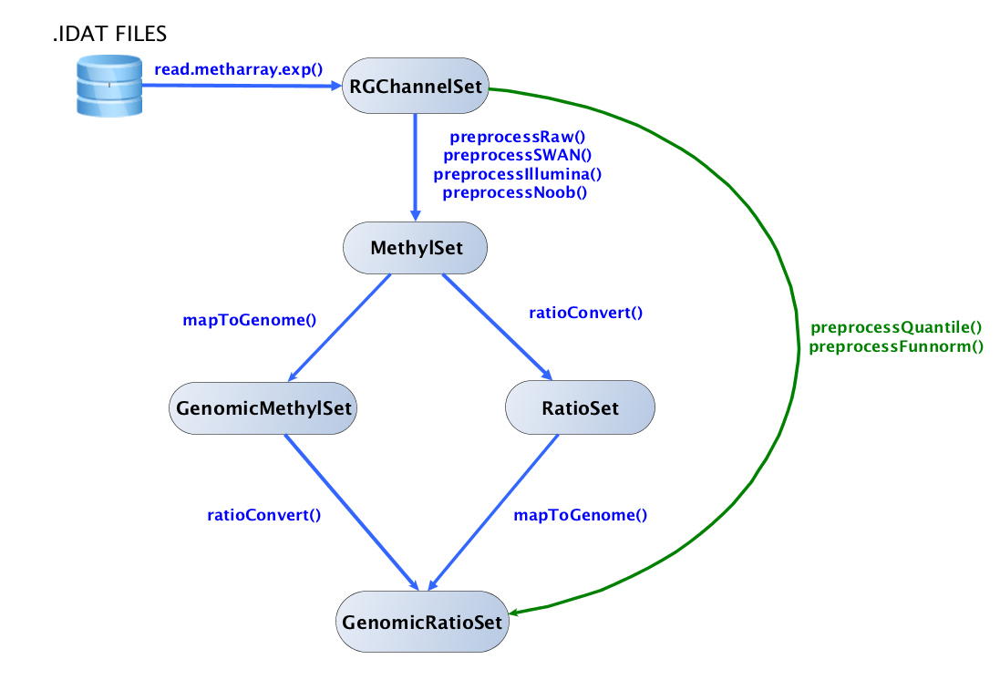

```{r style, echo = FALSE, results = 'asis'}
BiocStyle::markdown()
```

# Introduction

The goal of this tutorial is to present a standard analysis workflow of 450K data with the package `r Biocpkg("minfi")`, incorporating the functions recently added to the package. We invite you to read the software paper recently published [@minfi] and the online package vignette on the Bioconductor project website for more details.

We will start from the very beginning by reading input raw data (IDAT files) from an example dataset, and ending with a list of candidate genes for differential methylation. Among others, we will cover quality control assessments, different within-array and between-array normalizations, SNPs removal, sex prediction, differentially methylated positions (DMPs) analysis and bump hunting for differentially methylated regions (DMRs). 

If time permits, we will introduce a complementary interactive visualization tool package available through Bioconductor, `r Biocpkg("shinyMethyl")`, that allows interactive quality control assessment. 


## Dependencies

```{r, message=FALSE, warning=FALSE}
library(minfi)
library(minfiData)
library(sva)
```

These dependencies can be installed from Bioconductor using

```{r eval=FALSE}
source("http://www.bioconductor.org/biocLite.R")
biocLite(c("minfiData", "sva"))
```

This tutorial can be installed from GitHub using `r CRANpkg("devtools")` by

```{r eval=FALSE}
library(devtools)
install_github("hansenlab/tutorial.450k")
```


## 450k Array design and terminology

In this section, we briefly introduce the 450K array as well as the terminology used throughout the `r Biocpkg("minfi")` package. Each sample is measured on a single array, in two different color channels (red and green). As the name of the platform indicates, each array measures more than 450,000 CpG positions. For each CpG, we have two measurements: a methylated intensity and an unmethylated intensity. Depending on the probe design, the signals are reported in different colors:



For *Type I* design, both signals are measured in the same color: one probe for the methylated signal and one probe for the unmethylated signal. For *Type II* design, only one probe is used. The intensity read in the green channel measures the methylated signal, and the intensity read in the red channel measures the unmethylated signal.

Two commonly measures are used to report the methylation levels: Beta values and M values. 

**Beta value**:
$$\frac{M}{M + U + 100}$$

where $M$ and $U$ denote the methylated and unmethylated signals respectively. 

**MValue**:
$$Mval = \log{\biggl(\frac{M}{U}\biggr)}$$

**DMP**: Differentially methylated position: single genomic position that has a different methylated level in two different groups of samples (or conditions)

**DMR**: Differentially methylated region: when consecutive genomic locations are differentially methylated in the same direction. 

**Array**: One sample 

**Slide**: Physical slide containing 12 arrays ($6 \times 2$ grid)

**Plate** Physical plate containing at most 8 slides (96 arrays). For this tutorial, we use **batch** and plate interchangeably. 


# Reading Data

The starting point of `r Biocpkg("minfi")` is reading the .IDAT files with the built-in function `read.450k.exp`. Several options are available: the user can specify the sample filenames to be read in along with the directory path, or can specify the directory that contains the files. In the latter case, all the files with the extension .IDAT located in the directory will be loaded into R. The user can also read in a sample sheet, and then use the sample sheet to load the data into a `RGChannelSet`. For more information, see the `r Biocpkg("minfi")` vignette. Here, we will load the dataset containing 6 samples from the `r Biocpkg("minfiData")` package using the sample sheet provided within the package: 

```{r}
baseDir <- system.file("extdata", package="minfiData")
targets <- read.450k.sheet(baseDir)
targets
RGSet <- read.450k.exp(targets = targets)
```

The class of RGSet is a `RGChannelSet` object. This is the initial object of a minfi analysis that contains the raw intensities in the green and red channels. Note that this object contains the intensities of the internal control probes as well. Because we read the data from a data sheet experiment, the phenotype data is also stored in the `RGChannelSet` and can be accessed via the accessor command `pData`:

```{r}
phenoData <- pData(RGSet)
phenoData[,1:6]
```

The `RGChannelSet` stores also a manifest object that contains the probe design information of the array:

```{r}
manifest <- getManifest(RGSet)
manifest
head(getProbeInfo(manifest))
```

See the [minfi vignette](http://bioconductor.org/packages/release/bioc/vignettes/minfi/inst/doc/minfi.pdf) for more information. 


# Classes



## MethylSet and RatioSet

A `MethylSet` objects contains only the methylated and unmethylated signals.  You create this by

```{r}
MSet <- preprocessRaw(RGSet) 
MSet
```

This function matches up the different probes and color channels.  Note that the dimension of this object is much smaller than for the `RGChannelSet`; this is because CpGs measured by type I probes are measured by 2 probes.

The accessors `getMeth` and `getUnmeth` can be used to get the methylated and unmethylated intensities matrices:

```{r}
head(getMeth(MSet)[,1:3])
head(getUnmeth(MSet)[,1:3])
```

Other preprocessing functions exists; see below for an extensive discussion.

A `RatioSet` object is a class designed to store Beta values and/or M values instead of the methylated and unmethylated signals. An optional copy number matrix, `CN`, the sum of the methylated and unmethylated signals, can be also stored. Mapping a `MethylSet` to a `RatioSet` may be irreversible, i.e. one cannot be guranteed to  retrieve the methylated and unmethylated signals from a `RatioSet`.  A `RatioSet` can be created with the function `ratioConvert`:

```{r}
RSet <- ratioConvert(MSet, what = "both", keepCN = TRUE)
RSet
```

The functions `getBeta`, `getM` and `getCN` return respectively the Beta value matrix, M value matrix and the Copy Number matrix. 

```{r}
beta <- getBeta(RSet)
```

## GenomicRatioSet 

The function `mapToGenome` applied to a `RatioSet` object will add genomic coordinates to each probe together with some additional annotation information. The output object is a `GenomicRatioSet` (class holding M or/and Beta values together with associated genomic coordinates). It is possible to merge the manifest object with the genomic locations by setting the option `mergeManifest` to `TRUE`.

```{r}
GRset <- mapToGenome(RSet)
GRset
```

Note that the `GenomicRatioSet` extends the class `SummarizedExperiment`. Here are the main accessors functions to access the data:

```{r}
beta <- getBeta(GRset)
M <- getM(GRset)
CN <- getCN(GRset)
```

```{r}
sampleNames <- sampleNames(GRset)
probeNames <- featureNames(GRset)
pheno <- pData(GRset)
```
  
To return the probe locations as a `GenomicRanges` objects, one can use the accessor `granges`:

```{r}
gr <- granges(GRset)
head(gr, n= 3)
```

To access the full annotation, one can use the command `getAnnotation`:

```{r}
annotation <- getAnnotation(GRset)
names(annotation)
```

## GenomicMethylSet

The `mapToGenome` function can also be used on `MethylSet` to get a `GenomicMethylSet`.  The `ratioConvert` and `mapToGenome` functions commute, see the diagram above.


# Quality control

## QC plot 

`r Biocpkg("minfi")` provides a simple quality control plot that uses the log median intensity in both the methylated (M) and unmethylated (U) channels. When plotting these two medians against each other, it has been observed that good samples cluster together, while failed samples tend to separate and have lower median intensities. In order to obtain the methylated and unmethylated signals, we need to convert the `RGChannelSet` to an object containing the methylated and unmethylated signals using the function `preprocessRaw`. It takes as input a `RGChannelSet` and converts the red and green intensities to methylated and unmethylated signals according to the special 450K probe design, and returns the converted signals in a new object of class `MethylSet`. It does not perform any normalization.


The accessors `getMeth` and `getUnmeth` can be used to get the methylated and unmethylated intensities matrices:

```{r}
head(getMeth(MSet)[,1:3])
head(getUnmeth(MSet)[,1:3])
```

The functions `getQC` and `plotQC` are designed to extract and plot the quality control information from the `MethylSet`:

```{r}
qc <- getQC(MSet)
head(qc)
plotQC(qc)
```

Moreover, the function `addQC` applied to the `MethylSet` will add the QC information to the phenotype data. 

To further explore the quality of the samples, it is useful to look at the Beta value densities of the samples, with the option to color the densities by group:

```{r}
densityPlot(MSet, sampGroups = phenoData$Sample_Group)
```

or density bean plots:

```{r}
densityBeanPlot(MSet, sampGroups = phenoData$Sample_Group)
```

`r Biocpkg("shinyMethyl")` is particularly useful to visualize all plots at the same time in an interactive fashion. 


## Control probes plot

The 450k array contains several internal control probes that can be used to assess the quality control of different sample preparation steps (bisulfite conversion, hybridization, etc.). The values of these control probes are stored in the initial `RGChannelSet` and can be plotted by using the function `controlStripPlot` and by specifying the control probe type:

```{r}
controlStripPlot(RGSet, controls="BISULFITE CONVERSION II")
```

All the plots above can be exported into a pdf file in one step using the function `qcReport`:

```{r, eval=FALSE}
qcReport(RGSet, pdf= "qcReport.pdf")
```


## Sex prediction

By looking at the median total intensity of the X chromosome-mapped probes, denoted $med(X)$, and the median total intensity of the Y-chromosome-mapped probes, denoted $med(Y)$, one can observe two different clusters of points corresponding to which gender the samples belong to. To predict the gender, minfi separates the points by using a cutoff on $\log_2{med(Y)}-\log_2{med(Y)}$. The default cutoff is $-2$.  Since the algorithm needs to map probes to the X-chr and to the Y-chr, the input of the function `getSex` needs to be a `GenomicMethylSet` or a `GenomicRatioSet`. 

```{r}
predictedSex <- getSex(GRset, cutoff = -2)$predictedSex
head(predictedSex)
```

To choose the cutoff to separate the two gender clusters, one can plot $med(Y)$ against $med(Y)$ with the function `plotSex`:

```{r}
plotSex(getSex(GRset, cutoff = -2))
```

Finally, the function `addSex` applied to the `GenomicRatioSet` will add the predicted sex to the phenotype data. 

**Note**: the function does not handle datasets with only females or only males


# Preprocessing and normalization

So far, we did not use any normalization to process the data. Different normalization procedures are available in `r Biocpkg("minfi")`. Many people have asked us which normalization they should apply to their dataset. Our rule of thumb is the following. If there exist global biological methylation differences between your samples, as for instance a dataset with cancer and normal samples, or a dataset with different tissues/cell types, use the `preprocessFunnorm` function as it is aimed for such datasets. On the other hand, if you do not expect global differences between your samples, for instance a blood dataset, or one-tissue dataset, use the `preprocessQuantile` function. In our experience, these two normalization procedures perform always better than the functions `preprocessRaw`, `preprocessIllumina` and `preprocessSWAN` discussed below. For convenience, these functions are still implemented in the minfi package. 

## preprocessRaw

As seen before, it converts a `RGChannelSet` to a `MethylSet` by converting the Red and Green channels into a matrix of methylated signals and a matrix of unmethylated signals. No normalization is performed. 

Input: `RGChannelSet`  
Output: `MethylSet`

## preprocessIllumina

Convert a `RGChannelSet` to a `MethylSet` by implementing the preprocessing choices as available in Genome Studio: background subtraction and control normalization. Both of them are optional and turning them off is equivalent to raw preprocessing (`preprocessRaw`):

```{r}
MSet.illumina <- preprocessIllumina(RGSet, bg.correct = TRUE,
                               normalize = "controls")
```

Input: `RGChannelSet`  
Output: `MethylSet`

## preprocessSWAN

Perform Subset-quantile within array normalization (SWAN) [@swan], a within-array normalization correction for the technical differences between the Type I and Type II array designs. The algorithm matches the Beta-value distributions of the Type I and Type II probes by applying a within-array quantile normalization separately for different subsets of probes (divided by CpG content). The input of SWAN is a `MethylSet`, and the function returns a `MethylSet` as well. If an `RGChannelSet` is provided instead, the function will first call `preprocessRaw` on the `RGChannelSet`, and then apply the SWAN normalization. We recommend setting a seed (using `set.seed`) before using `preprocessSWAN` to ensure that the normalized intensities will be reproducible. 

```{r}
MSet.swan <- preprocessSWAN(RGSet)
```

Input: `RGChannelSet` or `MethylSet`  
Output: `MethylSet`

## preprocessQuantile

This function implements stratified quantile normalization preprocessing.  The normalization procedure is applied to the Meth and Unmeth intensities separately. The distribution of type I and type II signals is forced to be the same by first quantile normalizing the type II probes across samples and then interpolating a reference distribution to which we normalize the type I probes. Since probe types and probe regions are confounded and we know that DNAm distributions vary across regions we stratify the probes by region before applying this interpolation. Note that this algorithm relies on the assumptions necessary for quantile normalization to be applicable and thus is not recommended for cases where global changes are expected such as in cancer-normal comparisons. Note that this normalization procedure is essentially similar to one previously presented [@Touleimat:2012]. The different options can be summarized into the following list:

1. If `fixMethOutlier` is `TRUE`, the functions fixes outliers of both the methylated and unmethylated channels when small intensities are close to zero. 
2. If `removeBadSamples` is `TRUE`, it removes bad samples using the QC criterion discussed previously 
3. Performs stratified subset quantile normalization if `quantileNormalize=TRUE` and `stratified=TRUE`
4. Predicts the sex (if not provided in the `sex` argument)  using the function `getSex` and normalizes males and females separately for the probes on the X and Y chromosomes 

```{r}
GRset.quantile <- preprocessQuantile(RGSet, fixOutliers = TRUE,
  removeBadSamples = TRUE, badSampleCutoff = 10.5,
  quantileNormalize = TRUE, stratified = TRUE, 
  mergeManifest = FALSE, sex = NULL)
```

Input: `RGChannelSet`  
Output: `GenomicRatioSet`

**Note**: The function returns a `GenomicRatioSet` object ready for downstream analysis. 

## preprocessNoob

The function `preprocessNoob` implements the noob background subtraction method with dye-bias normalization discussed in [@noob]. Briefly, the background subtraction method estimates background noise from the out-of-band probes and remove it for each sample separately, while the dye-bias normalization utilizes a subset of the control probes to estimate the dye bias. By default, the function will perform both procedures:

```{r}
MSet.noob <- preprocessNoob(RGSet)
```

Input: `RGChannelSet`  
Output: `MethylSet`

## preprocessFunnorm

The function `preprocessFunnorm` implements the functional normalization algorithm developed in [@funnorm]. Briefly, it uses the internal control probes present on the array to infer between-array technical variation. It is particularly useful for studies comparing conditions with known large-scale differences, such as cancer/normal studies, or between-tissue studies. It has been shown that for such studies, functional normalization outperforms other existing approaches [@funnorm]. By default, the function applies the `preprocessNoob` function as a first step for background substraction, and uses the first two principal components of the control probes to infer the unwanted variation. 

```{r}
GRset.funnorm <- preprocessFunnorm(RGSet)
```

Input: `RGChannelSet`  
Output: `GenomicRatioSet`

As the `preprocessQuantile` function, it returns a `GenomicRatioSet` object.


# Genetic variants and cell type composition

## SNPs

Because the presence of SNPs inside the probe body or at the nucleotide extension can have important consequences on the downstream analysis,  `r Biocpkg("minfi")` offers the possibility to remove such probes. The function `getSnpInfo`, applied to a `GenomicRatioSet`, returns a data frame with 6 columns containing the SNP information of the probes:

```{r}
snps <- getSnpInfo(GRset)
head(snps,10)
```

`Probe`, `CpG` and `SBE` correspond the SNPs present inside the probe body, at the CpG interrogation and at the single nucleotide extension respectively. The columns with `rs` give the names of the SNPs while the columns with `maf` gives the minor allele frequency of the SNPs based on the dbSnp database. The function `addSnpInfo` will add to the `GenomicRanges` of the `GenomicRatioSet` the 6 columns: 

```{r}
GRset <- addSnpInfo(GRset)
```

We strongly recommend to drop the probes that contain either a SNP at the CpG interrogation or at the single nucleotide extension.The function `dropLociWithSnps` allows to drop the corresponding probes. Here is an example where we drop the probes containing a SNP at the CpG interrogation and/or at the single nucleotide extension, for any minor allele frequency:


```{r}
GRset <- dropLociWithSnps(GRset, snps=c("SBE","CpG"), maf=0)
```


## Cell type composition

As shown in [@Jaffe:2014], biological findings in blood samples can often be confounded with cell type composition. In order to estimate the confounding levels between phenotype and cell type composition, the function `estimateCellCounts` depending on the package `r Biocpkg("FlowSorted.Blood.450k")`estimates the cell type composition of blood samples by using a modified version of the algorithm described in [@Houseman:2012]. The function takes as input a `RGChannelSet` and returns a cell counts vector for each samples:

```{r, eval=FALSE}
library(FlowSorted.Blood.450k)
cellCounts <- estimateCellCounts(RGset)
```


# Identifying DMRs and DMPs

## dmpFinder: to find differentially methylated positions (DMPs)

While we do not particularly encourage a single position differential methylation analysis, the function `dmpFinder` finds differentially methylated positions (DMPs) with respect to a phenotype covariate. The phenotype may be categorical (e.g. cancer vs. normal) or continuous (e.g. blood pressure). Below is an example of a DMP analysis for age using the `GRset.funnorm` object created above:

```{r}
beta <- getBeta(GRset.funnorm)
age  <- pData(GRset.funnorm)$age
dmp <- dmpFinder(beta, pheno = age  , type = "continuous")
head(dmp)
```

The function is essentially a wrapper around `lmFit` from `r Biocpkg("limma")`.
 
## bumphunter: to find differentially methylated regions (DMRs)

The `bumphunter` function in minfi is a version of the bump hunting algorithm [@bumphunter] adapted to the 450k array, relying on the `bumphunter` function implemented in the eponym package `r Biocpkg("bumphunter")` 

Instead of looking for association between a single genomic location and a phenotype of interest, `bumphunter` looks for genomic regions that are differentially methylated between two conditions. In the context of the 450k array, the algorithm first defines clusters of probes. Clusters are simply groups of probes such that two consecutive probe locations in the cluster are not separated by more than some distance `mapGap`. 

Briefly, the algorithm first computes a t-statistic at each genomic location, with optional smoothing. Then, it defines a candidate region to be a cluster of probes for which all the t-statistics exceed a predefined threshold. To test for significance of the candidate regions, the algorithm uses permutations (defined by the parameter `B`). The permutation scheme is expensive, and can take a few days when the number of candidate bumps is large. To avoid wasting time, we propose the following guideline:

1. Define your phenotype of interest
```{r}
pheno <- pData(GRset.funnorm)$status
designMatrix <- model.matrix(~ pheno)
```
2. Run the algorithm with `B=0` permutation on the Beta-values, with a medium difference cutoff, say `0.2` (which corresponds to `20\%` difference on the Beta-values):
```{r, eval=FALSE}
dmrs <- bumphunter(GRset.funnorm, design = designMatrix, 
             cutoff = 0.2, B=0, type="Beta")
```
3. If the number of candidate bumps is large, say $>30000$, increase the cutoff to reduce the number of candidate bumps. The rationale behind this is that the most of the additional candidate regions found by lowering the cutoff will be found to be non-significant after the permutation scheme,  and therefore time can be saved by being more stringent on the cutoff (high cutoff).  
4. Once you have decided on the cutoff, run the algorithm with a large number of permutations, say `B=1000`:
```{r, eval=FALSE}
dmrs <- bumphunter(GRset.funnorm, design = designMatrix, 
             cutoff = 0.2, B=1000, type="Beta")
```

Since the permutation scheme can be expensive, parallel computation is implemented in the `bumphunter` function. The [foreach](http://cran.r-project.org/web/packages/foreach/index.html) package allows different parallel `back-ends` that will distribute the computation across multiple cores in a single machine, or across machines in a cluster. For instance, if one wished to use 3 cores, the two following commands have to be run before running bumphunter:

```{r, eval=FALSE}
library(doParallel)
registerDoParallel(cores = 3)
```

The results of `bumphunter` are stored in a data frame with the rows being the different differentially methylated regions (DMRs): 

```{r,  eval=FALSE}
names(dmrs)
head(dmrs$table, n=3)
```
  
As an example, we have run the bump hunting algorithm to find DMRs between colon and kidney (20 samples each from TCGA), with $B=1000$ permutations, and a cutoff of 0.2 on the Beta values:
  
```{r, eval=FALSE}
data("dmrs_B1000_c02")
head(dmrs$table)
```

The `start` and `end` columns indicate the limiting genomic locations of the DMR; the `value` column indicates the average difference in methylation in the bump, and the `area` column indicates the area of the bump with respect to the 0 line. The `fwer` column returns the family-wise error rate (FWER) of the regions estimated by the permeation scheme. One can filter the results by picking a cutoff on the FWER. 


## Block finder.

The approximately 170,000 open sea probes on the 450K array can be used to detect long-range changes in methylation status. These large scale changes that can range up to several Mb have typically been identified only through whole-genome bisulfite sequencing. The function `blockFinder` groups the average methylation values in open-sea probe cluster (via `cpgCollapse`) into large regions, and then run the `bumphunter` algorithm with a large (250KB+) smoothing window (see the bump hunting section for DMRs above).


## Batch effects correction with SVA

Surrogate variable analysis (SVA) [@sva1,@sva2] is a useful tool to identified surrogate variables for unwanted variation while protecting for a phenotype of interest. In our experience, running SVA after normalizing the 450K data with `preprocessFunnorm` or `preprocessQuantile` increases the statistical power of the downstream analysis. For instance, to run SVA on the M-values, protecting for case-control status, the following code can be used to estimate the surrogate variables (this can take a few hours to run):

```{r}
library(sva)
mval <- getM(GRset)[1:5000,]
pheno <- pData(GRset)
mod <- model.matrix(~as.factor(status), data=pheno)
mod0 <- model.matrix(~1, data=pheno)
sva.results <- sva(mval, mod, mod0)
```

Once the surrogate variables are computed, one can include them in the downstream analysis to adjust for unknown unwanted variation. See the [sva vignette](http://bioconductor.org/packages/release/bioc/vignettes/sva/inst/doc/sva.pdf) for a more comprehensive use of `sva`.


# Other tasks

## A/B compartments prediction.

The function `compartments` extracts A/B compartments from Illumina methylation microarrays, as described in [@reconstructbioRxiv]. Analysis of Hi-C data has shown that the genome can be divided into two compartments (A/B compartments) that are cell-type specific and are associated with open and closed chromatin respectively. The approximately 170,000 open sea probes on the 450k array can be used to estimate these compartments by computing the first eigenvector on a binned correlation matrix. The binning resolution can be specified by `resolution`, and by default is set to a 100 kb. We do not recommend higher resolutions because of the low-resolution probe design of the 450k array. For instance, to extract the compartments for chromosome 12, one can use

```{r, eval=FALSE}
ab <- compartments(grset.quantile, chr="chr14", resolution=100`1000)
```

## Potentially useful functions

### getSnpBeta

The array contains by design 65 probes that are not meant to interrogate methylation status, but instead are designed to interrogate SNPs. By default, minfi drops these probes. The function `getSnpBeta`  allows the user to extract the Beta values for those probes from an `RGChannelSet`. The return object is a matrix with the columns being the samples and the rows being the different SNP probes:

```{r}
snps <- getSnpBeta(RGSet)
head(snps)
```

These SNP probes are intended to be used for sample tracking and sample mixups. Each SNP probe ought to have values clustered around 3 distinct values corresponding to homo-, and hetero-zygotes.

### Out-of-band probes

The function `getOOB` applied to an `RGChannelSet` retrieves the so-called `out-of-band` (OOB) probes. These are the measurements of Type I probes in the "wrong" color channel. They are used in the `preprocessNoob` and `preprocessFunnorm` functions to estimate background noise. The function returns a list with two matrices, named `Red` and `Grn`.

```{r}
oob <- getOOB(RGSet)
```


# Session information

As last part of this document, we call the function `sessionInfo`, which reports the version numbers of R and all the packages used in this session. It is good practice to always keep such a record as it will help to trace down what has happened in case that an R script ceases to work because the functions have been changed in a newer version of a package. The session information should also **always** be included in any emails to the [Bioconductor support site](https://support.bioconductor.org) along with all code used in the analysis.

```{r}
sessionInfo()
```


# References

